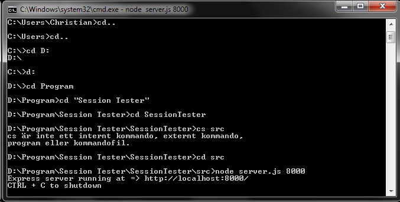

#INSTRUCTIONMANUAL SESSION TESTER

##For users/testers:
The application is currently accessible on the web for users that wants to try its functions or get inspired as a contributer or to brainstorm some future features. You can access the application at: http://paulmedia.se/iris/sessiontester/src/index.html.
Note that this application have ONLY been tested in google chrome and therefor do not have the behaviour or functionality for other browers or mobile units. If you can't access the application it's possible that a newer version of the application is avalible or that the server is temporary down for maintenance. Make sure to check github for a release-notes or send a mail to poplabbet@gmail.com for server-releated questions.

##For developers:
The application has been developed in sublime texteditor and it's strongly recommended to use it for further developing as it has not yet been tested in another IDE, though of course it's optional to use whatever IDE a developer would want to use. Sublime texteditor is free-to-use and can been found at: http://www.sublimetext.com/
To run the application locally a NodeJS server is required. Download it from https://nodejs.org/ and follow their installation-guide.

* Step 1: clone this repo from github
* Step 2: Make sure you have NodeJs, npm and bower installed globally.
* Step 3: Go to: session-tester/trunk/src/
* Step 4: Run command: npm install
* Step 5: Run command: bower install
* Step 6: Run command: node . (starts the node server)
* Step 7: DONE. Now go to: http://localhost:8000/ 

Example on how to run the nodeJS server
 

Open a browser-window and type localhost:8000 in the address field. And you're good to go.
To get in touch with the developers for Session Testers you can email them at:

* Christian Karlsson - [karlsson.j.christian@gmail.com](karlsson.j.christian@gmail.com)
* Paul Lachenardière - [poplabbet@gmail.com](poplabbet@gmail.com)
* Martin Jansson (Project Manager) - [martin.jansson@qualityminds.se](martin.jansson@qualityminds.se)

